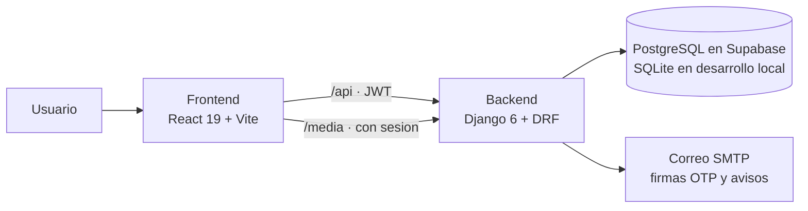
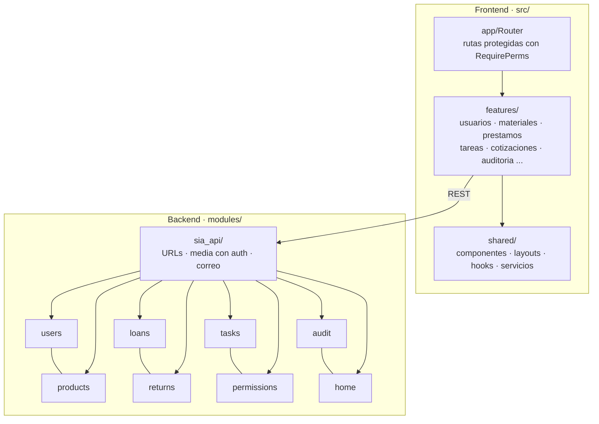
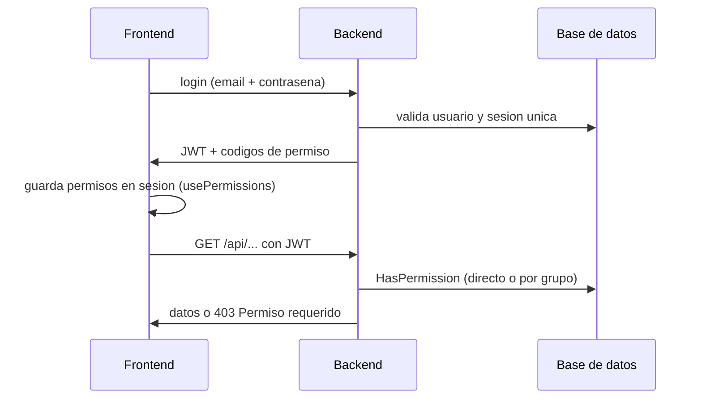

# Arquitectura de SAGI

Visión general del sistema: dos aplicaciones (frontend + API) sobre una sola base de datos.

## Diagrama general

- En desarrollo, Vite redirige `/api` y `/media` al backend (`127.0.0.1:8000`); el frontend no necesita `.env`.
- Los archivos (`/media`: fotos, fichas, cotizaciones) solo se sirven con sesión (Ley 1581 de 2012).

## Módulos

## Autenticación y permisos

Reglas clave:

- **Superusuario** > **permiso directo** > **permiso por grupo**.
- Los permisos se administran en la UI (Roles y permisos) y se exigen en el backend con `HasPermission("<codename>")`; el frontend los refleja con `MODULE_PERMS` (nunca nombres de grupo hardcodeados).
- Las migraciones crean los permisos y los grupos base (`SADMIN`, `ADMIN`, `INST`, `INV`).

## Capturas de pantalla

Las imágenes de la interfaz viven en [`capturas/`](capturas/) y se muestran en el [README](../README.md). Formato sugerido: PNG, 1280px de ancho, nombres `01-login.png`, `02-panel.png`, …

---

← [Volver al README](../README.md) · [Instalación local](instalacion-local.md)
